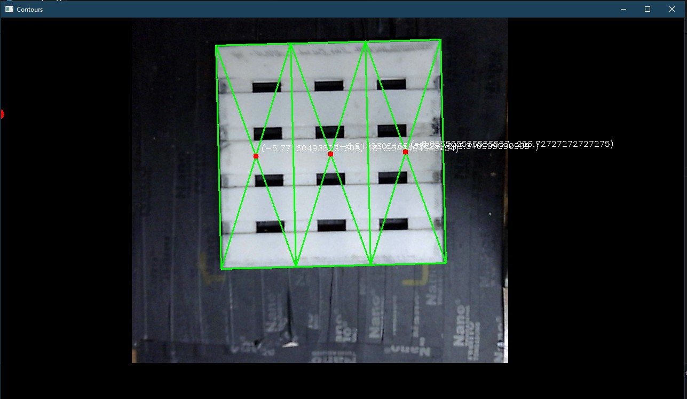
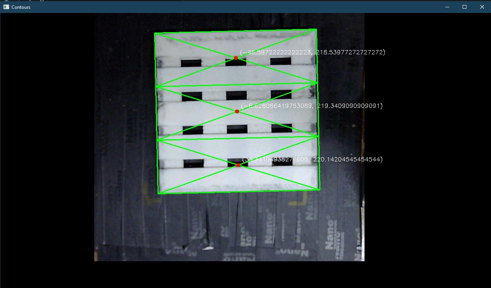
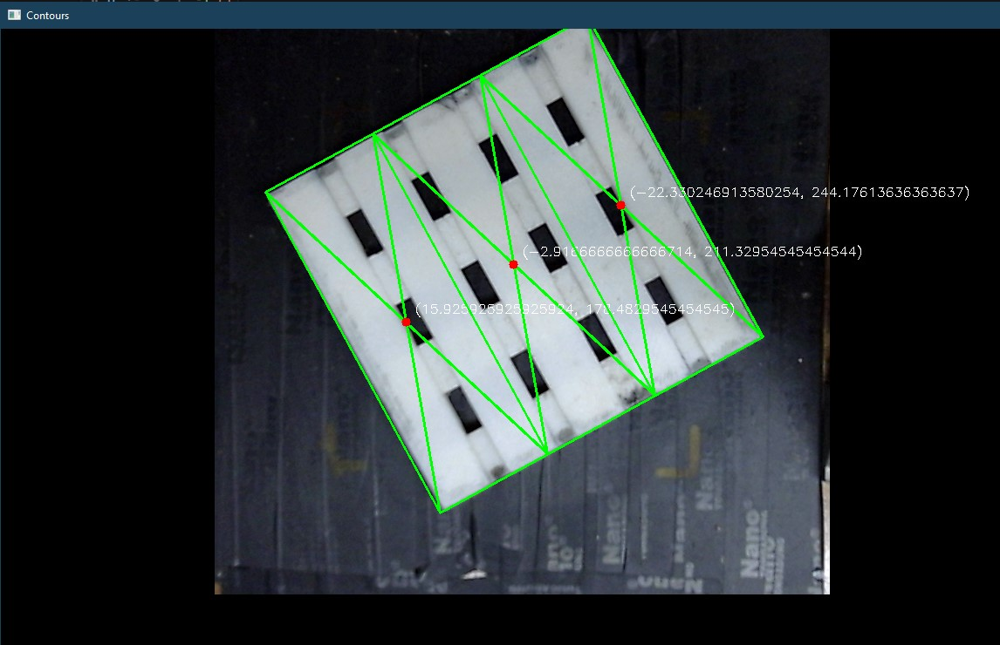

# Automated Palletizer System with Image Processing

## ✨ Project Description
The Automated Palletizer System with Image Processing is a computer vision-based solution designed to automate the palletizing process in industrial environments. The system leverages advanced image processing techniques to detect pallets, calculate their coordinates, and divide them into predefined modules, ensuring precise and efficient palletizing operations.

## 🔧 Key Features
- **Pallet Detection:** Accurately detects pallets using image processing algorithms.
- **Coordinate Calculation:** Determines the precise coordinates of pallets for robotic handling.
- **Module Division:** Divides the pallet into equal modules for systematic processing.
- **PLC Integration:** Communicates with PLC systems to send coordinates and division data.

## 🛠️ Technologies Used
- **Programming Language:** Python
- **Image Processing Libraries:** OpenCV, NumPy
- **PLC Communication:** Snap7
- **Hardware:** Industrial Camera, PLC (e.g., Siemens), Robotic Arm
- **Development Tools:** Visual Studio Code, Git

## 📦 Installation
### System Requirements
- Python 3.8+
- OpenCV (`pip install opencv-python`)
- Snap7 (`pip install python-snap7`)
- NumPy (`pip install numpy`)

### Installation Steps
1. Clone the repository:
   ```bash
   git clone https://github.com/NamThanhLe1907/Final-Project.git
   ```
2. Install the required libraries:
   ```bash
   pip install -r requirements.txt
   ```
3. Configure the PLC and camera settings.
4. Run the program:
   ```bash
   python main.py
   ```

## 🚀 How It Works
### Pallet Detection
- The system captures images from the industrial camera.
- Using OpenCV, it detects the pallet and calculates its coordinates.

### Module Division
- The pallet is divided into equal modules based on predefined parameters.
- The coordinates of each module are calculated for further processing.

### PLC Communication
- The system sends the calculated coordinates and division data to the PLC.
- The PLC uses this data to control the robotic arm for palletizing.

## 🗂️ Project Structure
```
automated-palletizer-system
*UPDATING*
```

## 📸 Demo (Updating)
1. **Pallet detection, coordinate calculation and Module division**
| Result 1 | Result 2 |
|----------|----------|
|  |  |
| Result 3 | Result 4 |
|  |  |

| Simu 1 | Simu 2 |
|----------|----------|
|  |  |

2. **Robotic handling**
*ONGOING*

## 📜 License


## 📞 Contact
- **Author:** [Nam Thanh Le]  
- **Email:** namthanhle1907@example.com  
- **GitHub:** [NamThanhLe1907](https://github.com/NamThanhLe1907)  

Thank you for your interest in this project! 🎉
